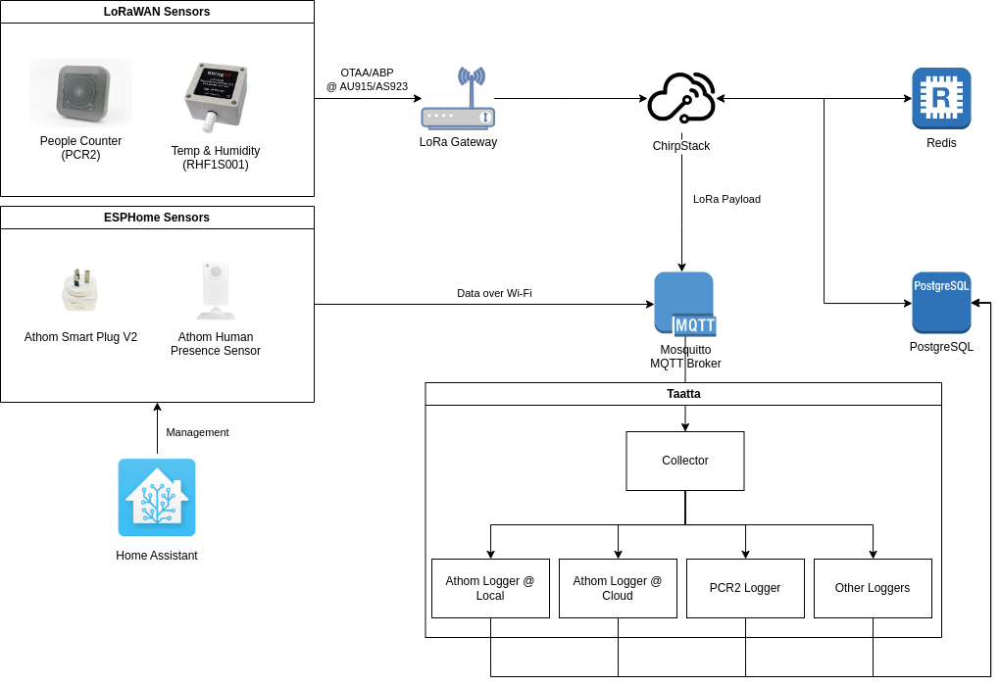

# Taatta

[](https://github.com/MonashSmartCityLivingLab/taatta/actions/workflows/ci.yml)
[](LICENSE)

A data logger for IoT devices and smart sensors that publish their data using MQTT.

## Architecture

The system adopts a microservices architecture, consisting of a collector module and a writer module for each sensor
type. This enables you to run multiple instances of the modules as well as easily add and expand the modules. Each
module is a Spring Boot application, written in Java or Kotlin. A collector module subscribes MQTT topics from the
broker and then sends it to the sensor module which then writes it to the database (currently PostgreSQL).



## Supported sensors

- LoRaWAN sensors (via [ChirpStack](https://chirpstack.io/))
    - [PCR2](pcr2/README.md) people counter
    - [TBS220](tbs220/README.md) parking sensor
    - [DF702](df702/README.md) bin sensor
    - [RHF1S001](rhf1s001/README.md) temperature and humidity sensor
- ESPHome-based appliances
    - [Athom Smart Plug V2](athom-smart-plug/README.md)

## Development

### Dependencies

- [JDK 17](https://adoptium.net/temurin/releases/)
- [Kotlin](https://kotlinlang.org/docs/getting-started.html)
- [Maven](https://maven.apache.org/download.cgi) (optional -- wrapper included)

### Building

1. Clone the repository
2. Run `mvn -e package spring-boot:repackage` to build

The output .jar files are located in `<module_name>/target/<module_name>-<version>.jar`.

## Deployment

### Docker

This is the easiest way to deploy Taatta as it also deploys and sets up PostgreSQL, Mosquitto and ChirpStack for you.

You will need to have [Docker](https://docs.docker.com/get-docker/)
and [Docker Compose](https://docs.docker.com/compose/install/) installed.

1. Copy the environment variable file `.env.examle` to `.env`
2. review the `.env` file values
    - The hostnames and port numbers are already set up, but you should change the Postgres and Mosquitto passwords,
      especially for production instances
3. Review the Mosquitto and ChirpStack configuration at `configuration` directory
    - For example, you might want change the LoRa frequency for ChirpStack, or allow unauthenticated MQTT connections
4. Deploy the containers:

```shell
docker compose up -d
```

To run specific containers:

```shell
docker compose up -d <containers>
```

For example, if you only need to log Athom smart plug
data: `docker compose up -d mosquitto postgresql collector athom-smart-plug`

See the `docker-compose.yml` file for the full list of containers.

### Run as systemd service

Note: this method assumes you already have Mosquitto, PostgreSQL and all other services installed and configured

1. Create `taatta` user and group:

```shell
sudo groupadd taatta
sudo useradd --system -s /usr/bin/nologin -G taatta taatta
```

2. Create a new folder for module executable and change the owner of folder

```shell
sudo mkdir -p /usr/local/taatta
sudo chown -R taatta:taatta /usr/local/taatta
```

3. Copy all jar files to `/usr/local/taatta`, stripping version number from its filename (
   e.g. `collector-1.1-SNAPSHOT.jar` becomes `collector.jar`)
4. Copy systemd service files to `/usr/local/lib/systemd/system`
5. Copy the environment variables from `.env.example` to `/etc/taatta.env`
6. Adjust `/etc/taatta.env` as follows (change the passwords!)

```shell
# mosquitto
TAATTA_MOSQUITTO_HOST=localhost
TAATTA_MOSQUITTO_PORT=1883
# You may remove these if you don't want authenticated MQTT connections
# In that case, don't forget to set `allow_anonymous` to true and remove `password_file` in mosquitto.conf
TAATTA_MOSQUITTO_USER=taatta
TAATTA_MOSQUITTO_PASSWORD=changeme

# postgresql
TAATTA_POSTGRES_HOST=localhost
TAATTA_POSTGRES_PORT=5432
TAATTA_POSTGRES_USER=taatta
TAATTA_POSTGRES_PASSWORD=changeme

TAATTA_SENSOR_ROUTER=/usr/local/taatta/sensorRouters.json
```

7. Modify the hostnames on [`configuration/collector/sensorRouters.json`](configuration/collector/sensorRouters.json)
   so the urls are `https://localhost:<port_number>`, so that the collector sends the data to the correct URL
8. Copy `configuration/collector/sensorRouters.json` to `/usr/local/taatta`

9. Enable and run the services

```shell
sudo systemctl enable --now <service_name>.service
```

To check service status:

```shell
systemctl status <service_name>.service
```

To temporarily stop service:

```shell
sudo systemctl stop <service_name>.service
```

To permanently stop service:

```shell
sudo systemctl disable --now <service_name>.service
```

## Acknowledgements

Special thanks to [Mahabub Alam](https://github.com/whilemind) who initially developed this application.